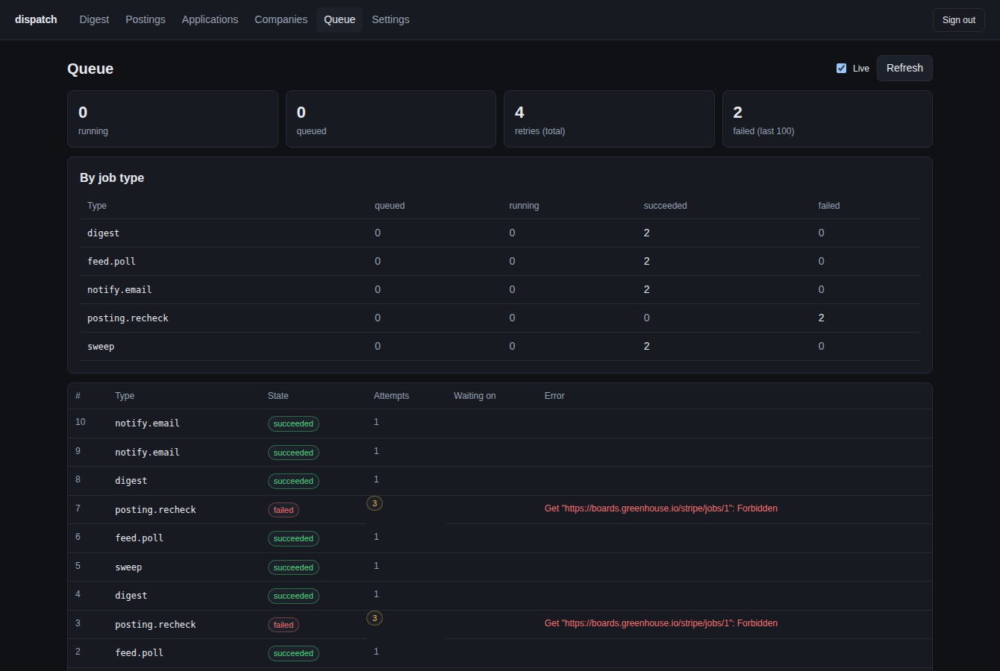
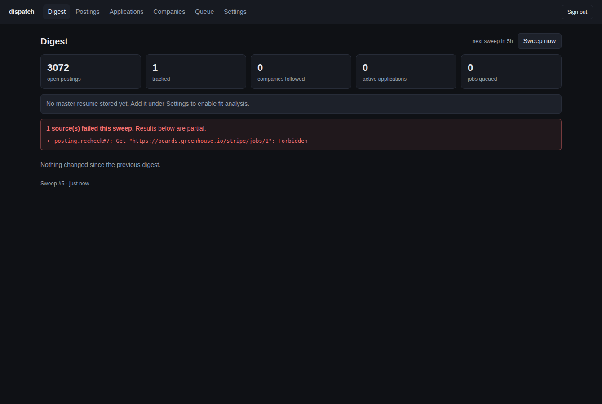
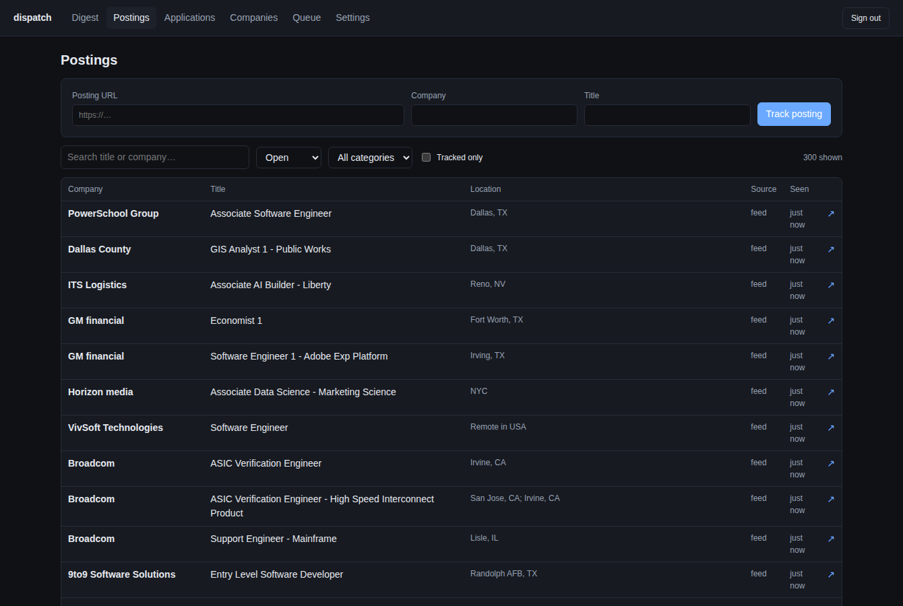
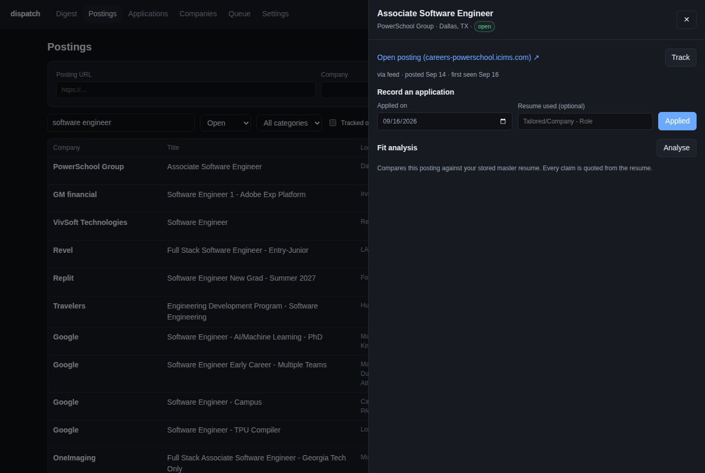

# Dispatch

A Go/PostgreSQL job queue with leases, fencing, retries, idempotency and a dependency graph, and an application tracker built on it that watches job boards and records applications. The tracker is the real workload; the queue is the engine under it.

[](https://github.com/Craymond0/dispatch-go/actions/workflows/ci.yml)



The queue view above is a real run: two sweeps, a feed poll that returned 304 on the second pass, and a posting recheck that exhausted its three attempts against an unreachable host. One sweep ingested **3,071 live postings across 1,149 companies** from the SimplifyJobs feed.

## Run locally

Install/start Docker Desktop, then run `docker compose -p raymond-dispatch up --build -d --scale worker=2` in this folder.

API: http://localhost:8088/healthz. Prometheus: http://localhost:9098. Submit a job with POST /jobs; poll GET /jobs/{id}. GET /jobs lists the latest 100 jobs. GET /metrics exports job counts by type and state plus retry totals.

A job is `{"type": "<handler name>", "payload": {...}}`. `type` defaults to `analyze`. Each handler validates its own payload at submission, so a bad payload is a 400, not a failed job. Unknown types are rejected with the list of registered handlers.

Example (local demo):

```sh
curl -X POST http://localhost:8088/jobs -H 'Content-Type: application/json' -H 'Idempotency-Key: example-1' \
  -d '{"type":"analyze","payload":{"company":"Example","title":"Software Engineer","description":"Go, Python, PostgreSQL, Docker and Linux"}}'
```

## Dashboard

React + TypeScript, built with Vite and embedded into the Go binary, so a deploy is one file with no separate static host. Sign in with `DASHBOARD_PASSWORD`.

| | |
|---|---|
|  |  |
| Digest: what changed since last sweep | Postings: filter 3,000+ live listings |



Opening a posting gives its details, a one-click application record, and the fit analysis.

Development: `npm --prefix web install && npm --prefix web run dev` proxies the API to `localhost:8088`. `npm --prefix web run build` writes into `internal/web/dist`, which `go build` embeds.

## Fit analysis

`POST /tracker/postings/{id}/fit` streams an assessment of how your stored master resume matches a posting, as server-sent events rendered token by token in the dashboard.

The system prompt is a grounding contract rather than a request for an opinion: the resume is the only source of truth about the candidate, every claimed match must quote the resume fragment that supports it, and anything the posting asks for that the resume does not show is reported as a gap rather than glossed. The posting text is extracted from its page on first use; pages rendered entirely by JavaScript fail with a 422 that asks you to paste the description instead, rather than sending the model an empty page.

Reports are cached per posting and invalidated whenever the resume or the description changes, since they were grounded in the previous text. Needs `ANTHROPIC_API_KEY`; without it the endpoint returns a clear 503 and nothing else breaks.

## CLI

`dispatchctl` is a small client over the same API, useful for operating the tracker without a browser.

```sh
go install ./cmd/dispatchctl
export DISPATCH_URL=https://dispatch.example.com DISPATCH_TOKEN=...

dispatchctl status
dispatchctl sweep && dispatchctl watch     # kick off a sweep, poll until idle
dispatchctl jobs --state failed
dispatchctl postings --q "new grad" --limit 20
dispatchctl follow https://jobs.lever.co/ramp
dispatchctl track https://careers.example.com/jobs/1 Example "New Grad SWE"
dispatchctl fit 42                          # streams the analysis to stdout
```

## Layout

```
cmd/dispatch/       the binary: API by default, worker with ROLE=worker or `dispatch worker`
cmd/dispatchctl/    CLI client
internal/queue/     the engine: schema, claim/finish, dependencies, handler registry
internal/analyze/   the demo handler (term matching)
internal/api/       HTTP surface over the queue
internal/tracker/   the application tracker: sources, job handlers, its own tables and routes
internal/llm/       streaming Anthropic Messages client (no SDK dependency)
internal/web/       embeds the built dashboard
internal/testdb/    per-package throwaway databases for tests
web/                React + TypeScript dashboard (Vite)
```

## Configuration

| Variable | Purpose |
|---|---|
| `DATABASE_URL` | Postgres connection string |
| `ROLE` | `api` (default) or `worker` |
| `API_TOKEN` | Bearer token for the API; required unless `DEMO_MODE=1` |
| `DASHBOARD_PASSWORD` | Enables the dashboard cookie login |
| `SESSION_SECRET` | Signs session cookies; derived from `API_TOKEN` if unset |
| `ANTHROPIC_API_KEY` | Enables fit analysis |
| `ANTHROPIC_MODEL` | Defaults to `claude-sonnet-5` |
| `RESEND_API_KEY`, `DIGEST_FROM`, `DIGEST_TO` | Email digests; all three or none |
| `SWEEP_INTERVAL` | Default `6h` |
| `WORKER_IDLE_MIN` | Poll interval while there is work; default `250ms` |
| `WORKER_IDLE_MAX` | Longest idle pause; default `10m`. See Idle cost below |
| `FEED_URL` | Override the job feed (tests, mirrors) |

## Handlers

Work is pluggable. A handler implements `Validate(payload)` and `Run(ctx, job)` and is registered by name in `newRegistry()`. The worker looks up the handler by the job's `type`; a job whose type has no handler in the running binary fails terminally rather than retrying against the same binary forever.

`analyze` is the built-in demo handler: it finds a fixed list of technology terms in a text in a single pass (see `matchTerms`).

## Tracker

The tracker turns the queue into something used daily. Every few hours a `sweep` job fans out into:

- `feed.poll`: the SimplifyJobs New-Grad-Positions listing (one 13 MB JSON file, fetched with `If-None-Match` so an unchanged feed costs a 304). About 3,000 active postings across 1,100 companies.
- `board.poll` per followed company: its Greenhouse, Lever or Ashby public board API, fresher than the feed.
- `posting.recheck` per tracked posting: does the URL still exist. A 404 here is a *result* (closed), not a failure.

and a `digest` that depends on all of them. The digest runs when every child has finished, whether or not it succeeded, and reports what changed since the last digest plus which sources failed. A fan-in that waited forever on one dead board would hide the problem; one that runs can name it.

The sweep runs on a schedule (`SWEEP_INTERVAL`, default 6h). Every worker ticks the scheduler, but on each tick exactly one wins a transaction-scoped advisory lock and enqueues whatever is due, so there is no long-lived leader to fail over and no duplicate sweeps. After an outage the schedule fires once and advances to the next future slot rather than replaying every missed interval.

Outbound requests go through a per-host token bucket (2 req/s, burst 4), so a sweep that fans out into fifty board polls cannot hammer one API.

### Idle cost

The worker does not poll in a tight loop. It claims at `WORKER_IDLE_MIN` (250ms) while there is work and backs off exponentially to `WORKER_IDLE_MAX` (10m) when there is not, resetting the moment anything runs, and it never sleeps past the next scheduled job. The connection pool holds no idle connections.

That combination is what makes this cheap to run. A serverless Postgres only suspends once nothing is connected, so a worker polling every 250ms keeps it awake all month whether or not there is anything to do. Four sweeps a day is a few minutes of real work; billing for 730 hours to do it is the difference between roughly $4 and roughly $24 a month.

The cost is latency on ad-hoc work: a job enqueued while the worker is at full backoff waits up to `WORKER_IDLE_MAX` to start. Scheduled sweeps and the digest are unaffected. Lower it if you are paying for always-on compute anyway and want manual sweeps to feel instant.

When a digest has anything to report it queues a `notify.email` job. With `RESEND_API_KEY`, `DIGEST_FROM` and `DIGEST_TO` set it sends through Resend, passing the same idempotency key to the provider so a retried send cannot deliver twice; unset, the job succeeds as skipped so a missing key never poisons a sweep.

Child jobs use idempotency keys derived from the sweep's own job id, so a sweep retried after a partial failure re-finds its children instead of duplicating them.

Each source reconciles against what is stored: new postings are recorded, changed ones updated, and postings a source no longer lists are closed. A failed poll closes nothing: absence of evidence is not evidence of absence.

Routes (all under the API token):

```
GET    /tracker/postings?state=open&tracked=1&category=Software&q=backend
POST   /tracker/postings            {url, title, company}       paste a posting; tracked immediately
PATCH  /tracker/postings/{id}       {tracked}
GET    /tracker/companies?followed=1
POST   /tracker/companies           {name, board_url}           follow a Greenhouse/Lever/Ashby board; polled right away
PATCH  /tracker/companies/{id}      {followed}
GET    /tracker/applications
POST   /tracker/applications        {posting_id, applied_on, resume_ref, notes}
PATCH  /tracker/applications/{id}   {status, last_contact_on, notes, resume_ref}
GET    /tracker/digest              latest digest
GET    /tracker/status              counts, next sweep, last digest
POST   /tracker/sweep               run a sweep now
```

Not covered: LinkedIn, Indeed and other sites that prohibit automated access. Companies that use Workday or a custom careers site come in through the feed or by pasting a URL, and are rechecked by status code only.

## Dependencies

A job may list `depends_on: [ids]` of jobs that already exist. It is not claimable until every one of them has reached a terminal state. Dependents are released on failure as well as success: a fan-in that never runs because one input failed hides the failure, whereas one that runs can see exactly which inputs failed (`GET /jobs/{id}` lists each dependency with its state). Handlers that need all-success semantics check that themselves.

Because a job can only depend on jobs that already exist, the graph is acyclic by construction. The dependency rows are locked while the pending count is computed, so a dependency finishing at the same instant cannot be missed. Retries do not release dependents; only `succeeded` and `failed` do, whichever path produced them (a handler result, a terminal error, or the expired-lease sweep).

The analyzer uses a small literal technology dictionary. It does not score candidacy, use an LLM, or imply that matching a word establishes proficiency.

## Reliability design

- PostgreSQL persists payloads, results, retry state and completion events.
- Atomic claims use row locks and SKIP LOCKED across independent workers.
- 45-second leases reclaim abandoned work after a crash. There is no lease renewal, so a handler that runs longer than the lease will have its job reassigned under it; every current handler finishes well inside it.
- Attempt numbers fence stale workers from committing results after reassignment.
- Failures retry with exponential delays up to three attempts, then remain visible as failed jobs. A handler can return `Terminal(err)` for failures that retrying cannot fix (malformed input, a permanent 404); those fail on the spot with a `failed_terminal` event and no further attempts.
- Idempotency keys deduplicate submissions and reject a different type or payload using the same key. Without a key, one is derived from the type and the canonicalised payload, so key order in the JSON does not matter.
- Delivery is at least once. Database result writes are fenced; external side effects would need their own idempotency design.
- Structured JSON logs include job ID and attempt. Prometheus metrics are durable database-derived state and retry counts. Distributed tracing and a Grafana dashboard are future work.

The `analyze` handler accepts `demo_delay_seconds` (0–30) and `demo_fail_attempts` (0–3) to exercise the delay and retry paths by hand. Both are rejected unless `DEMO_MODE=1`, which also disables the API token requirement, so never set it on a public deployment.

## Tests

```sh
createdb dispatch_test
TEST_DATABASE_URL='postgres://…/dispatch_test?sslmode=disable' go test -race ./...
npm --prefix web run typecheck
```

Each test package creates its own database named after it (`dispatch_test_queue`, `dispatch_test_tracker`, …), so `go test ./...` can run packages in parallel without them truncating each other's tables. The role needs `CREATE DATABASE`. Without `TEST_DATABASE_URL` the integration tests skip and the pure-Go ones still run.

External services are never contacted: the tracker tests drive `httptest` servers that impersonate the feed, Greenhouse, a posting page, Resend and the Anthropic API, including their failure modes.

### The chaos test

`TestChaosNoLostOrDuplicatedWork` is the one worth reading. Eight workers race for 120 jobs, and about a third of the time a worker abandons its in-flight job without reporting, which is what SIGKILL, an OOM kill or a severed connection look like to the database. Its lease then lapses and another worker takes the job.

It asserts four things, and the fourth is the point:

1. Every job ends `succeeded` — nothing was lost.
2. No job recorded two `succeeded` events — nothing ran to completion twice.
3. Every job holds exactly one result.
4. At least one stale completion was actually fenced out. A run where the race never happened would pass the first three trivially and prove nothing, so the test fails if the scenario it claims to exercise did not occur.

## Deploy

One image, two process groups, both reading the same Postgres. Fly.io and Neon's free tiers carry this workload; the older `render.yaml` provisions three paid resources and is kept only for reference.

```sh
fly launch --no-deploy --copy-config
fly secrets set DATABASE_URL='postgres://…neon.tech/dispatch?sslmode=require' \
                API_TOKEN="$(openssl rand -hex 32)" \
                SESSION_SECRET="$(openssl rand -hex 32)" \
                DASHBOARD_PASSWORD='…' \
                ANTHROPIC_API_KEY='…'
fly deploy
fly scale count app=1 worker=1 --vm-size shared-cpu-1x --vm-memory 256
curl https://<app>.fly.dev/healthz
```

The API machine suspends when idle and wakes on request; the worker stays up for the scheduler. Prometheus is not hosted: point any scraper at `/metrics` with the bearer token.

## Scope

No cancellation, user accounts, priority scheduling, or arbitrary code execution. Migrations run from one embedded schema string under an advisory lock rather than a versioned migration tool, which is fine at this size and would not be at a larger one. Rechecks on Workday and similar sites are status-code only, so a posting that returns 200 for a dead role still reads as open.

No throughput or latency figures are published here, because none have been measured under a realistic load. The chaos test establishes correctness under failure, not performance.

## How this was built

The first commit was scaffolded in a ChatGPT session. Everything after it (the handler registry, the single-pass matcher, the dependency graph, the tracker, CI) was developed with Claude Code, with design decisions and their reasoning recorded in `TRACKER_SPEC.md`. Direction, review, and the decisions are mine.
